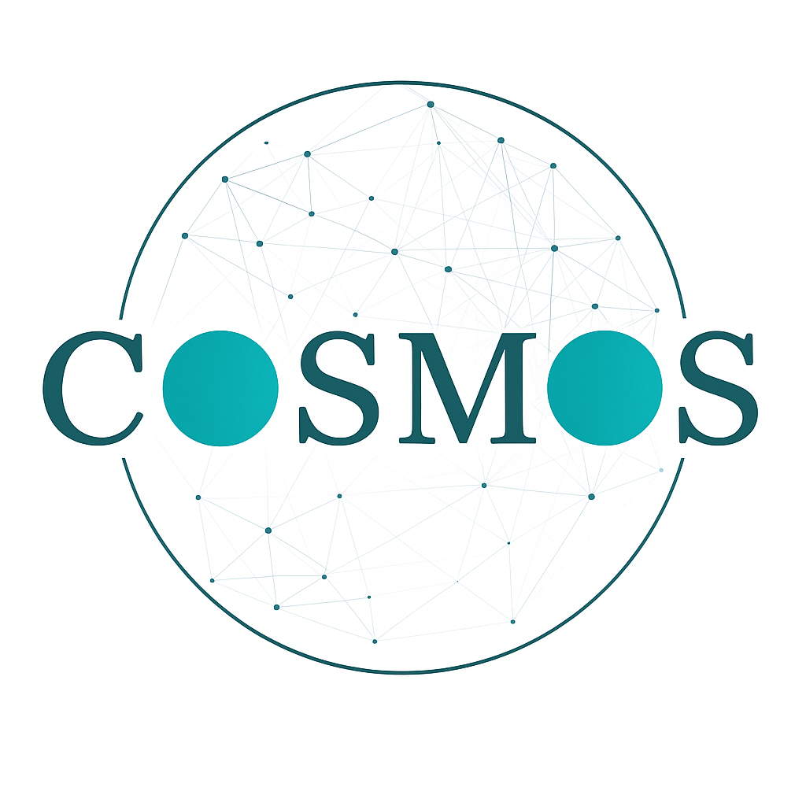

<p align="center">
  
</p>

# Welcome to COSMOS!
COSMOS (COunterfactual Simulations of MOderation Strategies) is a simulator of Online Social Network (OSN) conversations based on the Agent-Based Modeling (ABM) framework and powered with a Large Language Model (LLM). COSMOS is designed for evaluating the effectiveness of content moderation strategies on the toxic behavior emerging from users' characteristics and social interplay.

### Why COSMOS?
Assessing if a content moderation strategy is successfull or not can be challenging, for at least three reasons: 

1. The API restrictions imposed by private platforms prevent the collection of large amounts of evidence;
2. Toxic behavior is (fortunately) unfrequent;
3. Field observation can be biased by unknown confounders.
   
With COSMOS, we provide a cost-effective, maximally controllable solution for *generating* your evidence rather than *collecting* it from the real world.

### How does COSMOS work?

COSMOS initializes a population of LLM-based agents with custom social, psychological or demographic characteristics. In a simulation run, agents generate posts and comments in a OSN-like environment. Each action is replicated in a *counterfactual* simulation where a chosen moderation strategy is enforced under *ceteris paribus* conditions. In this way, at the end of the simulation you can tell *what would have happened* if that moderation strategy was employed on that population of users. 

For more details, read our paper [here](https://ojs.aaai.org/index.php/AAAI/article/view/41186).

# Usage

1. Download this repository on your local machine.
2. Edit the `experiments/config.json` file with your desired configuration. For details, see `api_reference.md`.
3. Run:

   ```bash
    python3 experiments/main.py 
    ```

Simulation data will be available in a JSON file at the specified `export_path` in `experiments/config.json`. For details about JSON output fields, see `api_reference.md`.

**Update**: Perspective API will be no longer in service after 2026 and usage requests have been addressed until February 2026. For this reason, COSMOS now uses a `detoxify` detector instead. For more details, check [here](https://pypi.org/project/detoxify/). 

# License
COSMOS is distributed under the GNU General Public License. Refer to LICENSE.txt for details.

**If you use COSMOS for your research, please cite:**
```bibtex
  @inproceedings{Fidone_Passaro_Guidotti_2026,
    author       = {Giacomo Fidone and
                    Lucia C. Passaro and
                    Riccardo Guidotti},
    title        = {Evaluating Online Moderation via LLM-Powered Counterfactual Simulations},
    booktitle    = {{AAAI}},
    pages        = {38451--38459},
    publisher    = {{AAAI} Press},
    year         = {2026}
  }
```
