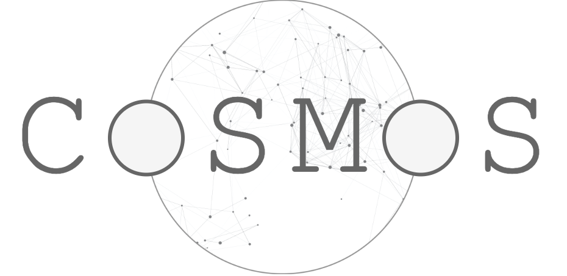
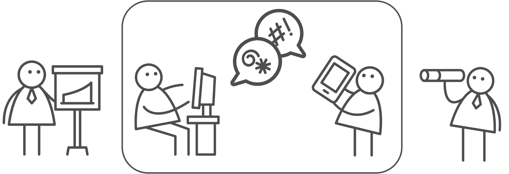

  

### What is COSMOS?
COSMOS (COunterfactual Simulations of MOderation Strategies) is an Online Social Network (OSN) simulator based on the Agent-Based Modeling (ABM) framework and powered with a Large Language Model (LLM). Differently from other OSN simulators, COSMOS is designed for evaluating the effectiveness of content moderation strategies on the toxic behavior emerging from users' socio-psychological traits and their social interplay.

### Why COSMOS?
Assessing if a content moderation strategy is successfull or not can be challenging, for at least three reasons: 

1. The API restrictions imposed by private platforms prevent the collection of large amounts of evidence;
2. Toxic behavior is (fortunately) unfrequent;
3. Field observation can be biased by unkown confounders.
   
With COSMOS, we provide a cost-effective, maximally controllable solution for *generating* your evidence rather than *collecting* it from the real world.

  

### How does COSMOS work?
COSMOS initializes a population of generative agents with given social, psychological or demographic characteristics. In a simulation run, agents generate posts and comments in a OSN-like environment. Each action, however, is replicated in a *counterfactual* stream of events where a moderation strategy is enforced under *ceteris paribus* conditions. In this way, at the end of the simulation you can tell *what would have happened* if that moderation strategy was employed on that population of users.

### How to use COSMOS?
