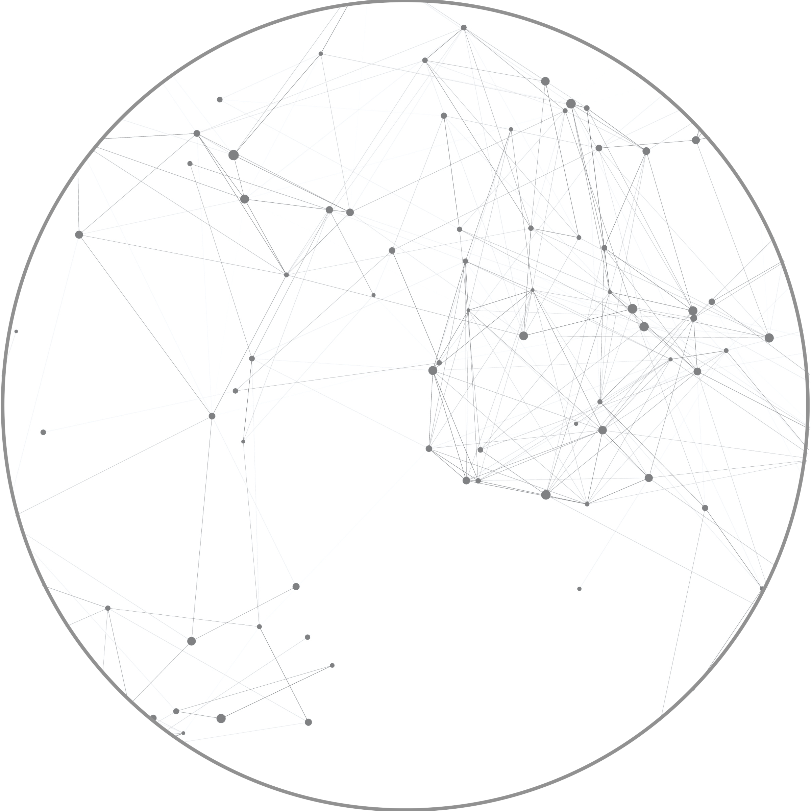

# API Reference
 
 
 

## Class `Simulator`
### Methods
- `__init__(model_path, thread_prob, comment_prob, tau, thr, topics, moderate_template, profiles)`
  
  **Inizializes a COSMOS object.**
   
    - `model_path` (*str*): path to the LLM (HuggingFace Hub).
    - `thread_prob` (*float*): probability to generate a post.
    - `comment_prob` (*float*): probability to generate a comment.
    - `tau` (*float*): temperature of the softmax function for selecting a node of the news feed.
    - `thr` (*float*): toxicity threshold for moderator activation.
    - `topics` (*list[str]*): array of topics for generating a post.
    - `moderate_template` (*str*): prompt template for moderator in PMI mode. For correct processing, it must feature XML tags `<personal information></personal information>` (profile module) and `<user submission></user submission>` (user submission).
    - `profiles` (*list[dict]*): profile modules (as a list of dictionaries). `username` is mandatory.

- `run(n_timesteps, post_no_memory, post_memory, comment_no_memory, comment_memory, intervene=True, intervene_func=None, ban=False, memory_size=1, one_size_fits_all=False, intervention=None, tolerance=None, generation_config=None, seed=None, active_stream=True)`

    **Runs a simulation.**
    - `n_timesteps` (*int*): number of timestamps.
    - `post_no_memory` (*str*): prompt template for post action without memory. For correct processing, it must feature XML tags `<personal information></personal information>` (profile module).
    - `post_no_memory` (*str*): prompt template for post action with memory. For correct processing, it must feature XML tags `<personal information></personal information>` (profile module) and `<intervention></intervention>` (memory module).
    - `comment_no_memory` (*str*): prompt template for comment action without memory. For correct processing, it must feature XML tags `<personal information></personal information>` (profile module) and `<thread></thread>` (sensory module).
    - `comment_no_memory` (*str*): prompt template for comment action with memory. For correct processing, it must feature XML tags `<personal information></personal information>` (profile module), `<thread></thread>` (sensory module) and `<intervention></intervention>` (memory module).
    - `intervene` (*bool*, default `True`): use *ex ante* interventions or not.
    - `intervene_func` (*callable | None*, default `None`): wrapper for external *ex ante* function. Requires `intervene=True`.
    - `ban` (*bool*, default `False`): use ban or not.
    - `tolerance` (*int | None*, default `None`): maximum number of infractions before the user is banned. Requires `ban=True`.
    - `memory_size` (default 1): maximum number of interventions stored in memory.
    - `one_size_fits_all` (*bool*, default `False`): use OFSA strategy. Requires `intervene=True`.
    - `intervention` (*str | None*, default `None`): message of OFSA strategy. Requires `one_size_fits_all=True`.
    - `generation_config` (*dict | None*, default `None`): configuration for LLM generation as a dictionary of parameters. `max_new_tokens` is mandatory.
    - `seed` (*int | None*, default `None`): random seed for reproducibility.
    - active_stream (*bool*, default `True`): generate counterfactual or not.
- `export(path)`
  
  **Exports results in JSON format.**
   - `path` (*str*): path to JSON file with simulation results.
     
### Attributes
- `feed` (*list[tree]*): array of threads as directed graphs (`networkx`).
- `history` (*list[list[dict]*): array of timestamps, where each times is an array containing a dictionary for storing information about each action.
